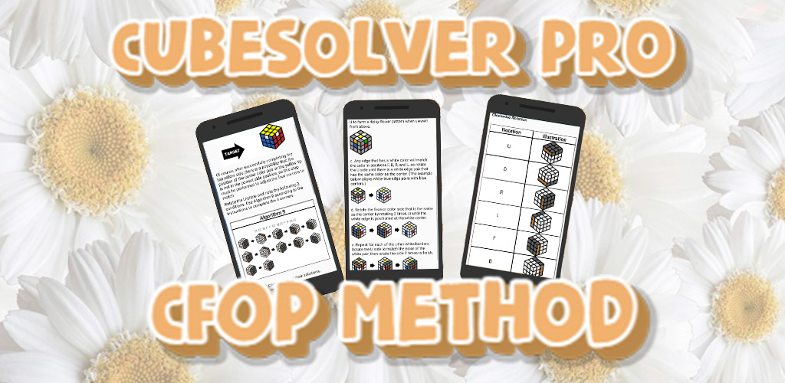
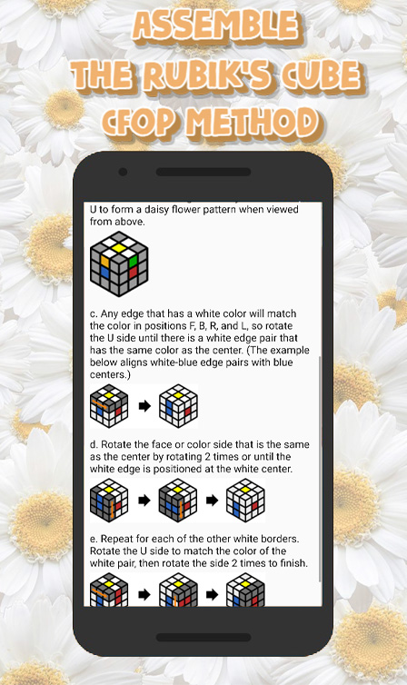
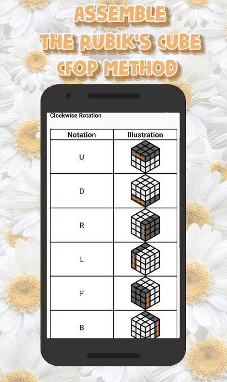
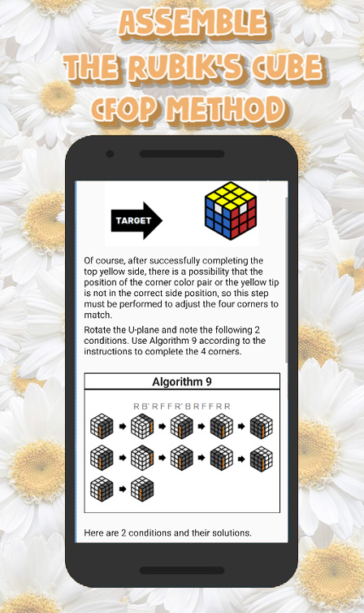

<h1 align="center"> Rubik's Cube Android Kotlin
- A pocket guide to solving Rubik's Cube puzzle for Android devices developed in IDE Android Studio</h1>

## Description

CubeSolver is a handy mobile app that teaches you how to assemble the Rubik's cube using the Friedrich method (CFOP) (also called the "daisy chain" or "daisy chain method").

The CFOP Tutorial: CubeSolver focuses on the Friedrich method (CFOP), a widely known and effective method of assembling the Rubik's Cube. The appendix includes a detailed guide to mastering the four key steps: Cross, F2L, OLL, and PLL.

With clear instructions, vivid illustrations and handy reference tables, this app is the perfect guide to mastering the CFOP method and assembling the Rubik's Cube at a professional level.

Rubik's Cube is designed to run on devices running the Android operating system version 4.4.2 (KitKat) and higher, written exclusively in Kotlin.

This mobile application is published in Google Play Market and is available for download at the link. <a href="https://play.google.com/store/apps/details?id=com.anatoliyvinokurov.rubikscube">link on Google Play Market</a>
<a href="https://play.google.com/store/apps/dev?id=7939525547152270598">My developer page in Google Play Market</a>

## Features include:

Step-by-step instructions. The application presents the CFOP method in a user-friendly format, breaking down the solution process into simple steps. Each step contains clear and concise instructions that make it easy for users to follow.

Visual Demonstrations: CubeSolver includes vivid images and visual demonstrations for better understanding. Detailed images show the correct finger placement and movement of the cube, allowing users to learn the CFOP method more effectively.

Algorithm Tables: the app includes handy algorithm tables that cover each step of the CFOP method. Users can easily access a wide range of algorithms for specific situations, helping them navigate complex cube configurations.

## Advantages of the method:

Efficiency: the CFOP method provides a faster solution and is considered one of the most efficient solution methods. CubeSolver gives users the skills needed to assemble the Rubik's cube quickly and efficiently.

Widespread use: the CFOP method is widely used in the SpeedCube community. By choosing the CFOP method, CubeSolver addresses a large user base and provides a valuable learning resource for those who want to improve their solving skills.

### Pictures

## Project setup

import this project to Android Studio

## Future scope

- Add translations to other languages.